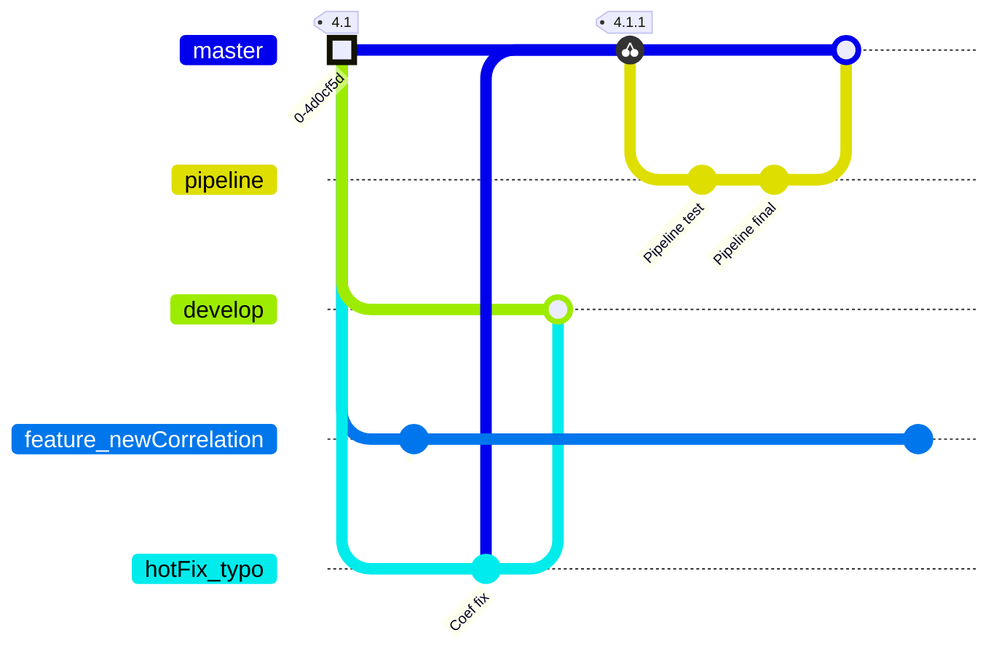

# Contribution and Development Guidelines

## First Things First: open an issue
To report a bug, request a new feature, propose a development or for any question, please open an [issue](https://gitlab.pam-retd.fr/thermosysproandco/ThermoSysPro/-/issues).

If you do not have an account on our GitLab platform you can:
- [Mail us](mailto:contact-thermosyspro@edf.fr) to have your account created.
- [Work in progress] Use the *Service Desk* [mail] to open an issue by mail and be notified on updates.
- [Last resort] [Mail us](mailto:contact-thermosyspro@edf.fr) your issue so that we can open it on GitLab on your behalf. 

## Development Committee
Regular monthly meeting are run by the EDF R&D team responsible for the development of ThermoSysPro. 
This Committee has the following objectives:
- Review new issues, discuss the potential solution, assign them to a developer.
- Approve developments and merge requests.
- Discuss the development roadmap (library main orientations for the future).

Partners or issue reporter may be invited to participate to this meeting.

## Code Development

### Repository structure
The [`master`](https://gitlab.pam-retd.fr/thermosysproandco/ThermoSysPro/-/tree/master?ref_type=heads) branch contains only official releases. This is the *default* branch of the repository. A *tag* is associated to each release. No development is made directly in this branch (which is *protected*).

The [`develop`](https://gitlab.pam-retd.fr/thermosysproandco/ThermoSysPro/-/tree/develop?ref_type=heads) branch is the receptacle of all developments. This branch is also *protected*, meaning that developments can only be done through  `feature` branches and *merge requests*; the `feature` branches originate in the `develop` branch and merge later on in it. The `develop` branch merges in the `master` to originate new official releases. 

#### Notable exceptions
Developments which are not related to the actual code (for example, files for CI/CD pipelines, readmes, minor documentation modification, graphics...) can be developed on `minor` branches that originate directly on `master` and are directly merged on it.

Such developments does not originate a new official release (no tag). This allows to quickly make available useful slight modifications (which do not affect the behavior of the models).

Another exception concerns **quick** bug correction. `hotFix` branches should originates in `develop`as common `feature` branches. However, their relative commit(s) should be cherry picked to `master`, giving place to a **patch version tag**. 

### Workflow
Here follows a synthetic view of the workflow for contribution:
1. Reporter: open an issue.

    &rarr; The issue will be reviewed by the Development Committee in the periodic meeting. Discussion on how to solve the issue can take place there and the issue will be commented accordingly. This first review should not delay the reporter from developing a solution by himself/herself following the next steps of the workflow. A developer from the Development Committee can also be designated to solve the issue.

    If developments are required (the issue is not a question, not *refused*...): 

1. Reporter/Developer: create a new `feature` branch from `develop`. *Hint: the branch can be created from the issue itself (to link the future developments to the issue)*.
1. Reporter/Developer: realize the necessary developments in as many *atomic* commits as needed. *Hint: cite the issue `#ID` in commit messages to link commits and issue*.
1. Reporter/Developer: create a merge request. 

    &rarr; The merge request will be reviewed by the Development Committee in their periodic meeting. 

1. If necessary, comments are added to the merge requests and some additional developments/iterations are requested.
1. DevCom action: The merge request is accepted and the `feature` branch is merged in the `develop` branch.

###  Non-Regression Tests [Work in progress] 

Every commit pushed to the remote generates the following actions (*CI/CD pipeline*):

- Run non-regression tests:
    - Check, for a set of test models:
        - the translation,
        - the simulation.
    - Verification of results compared to reference calculation.
    - Report generation and its storage.
- Mail a notification to:
    - the committer, 
    - the *Dev Committee* members,
    - the person in charge of a test model in case of issues for that model. 
     
The *test models* are the models of the `Example` package of ThermoSysPro and an additional library of *private* models. Please [mail](mailto:contact-thermosyspro@edf.fr) us if you want to include some of your model in the test suite.
